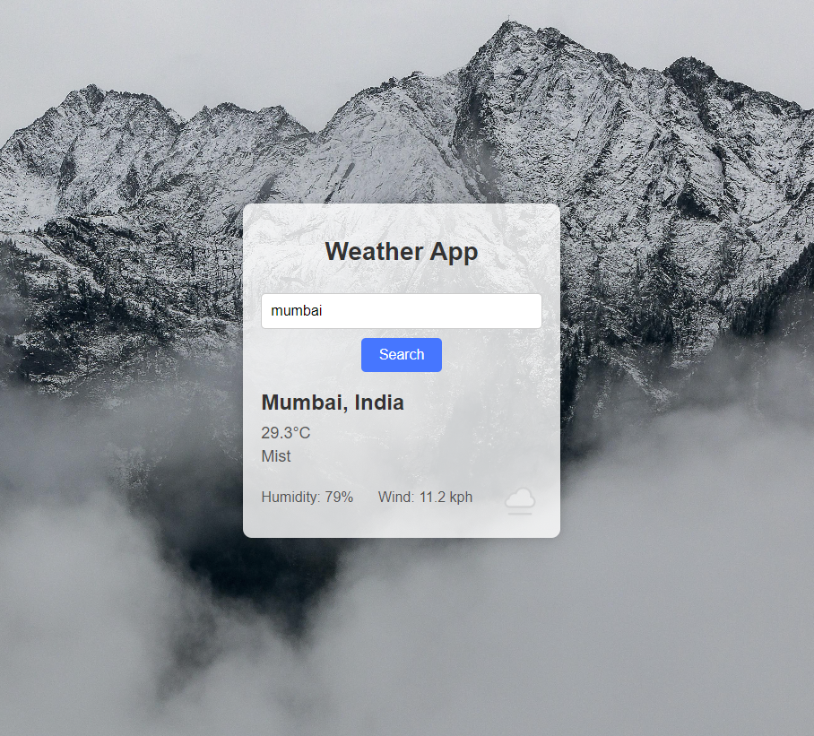

# PRODIGY_WD_05
Welcome to **Dynamic Weather App 🌦️**, a dynamic weather application that not only fetches real-time weather data but also enhances the user experience with a smooth background transition based on current weather conditions. This project is built using **HTML**, **CSS**, and **JavaScript**, offering a seamless and visually appealing way to stay updated with the weather.



## ✨ Features

- **Real-Time Weather Data**: Fetches and displays weather information for any location.
- **Dynamic Backgrounds**: Automatically changes the background image to match the current weather condition.
- **Smooth Transitions**: Provides a smooth and visually appealing transition between different weather states.
- **User-Friendly Interface**: Clean and responsive design for a great user experience across all devices.

## 🛠️ Project Structure

```plaintext
├── index.html          # Main HTML structure
├── styles.css          # CSS styling for the app
├── script.js           # JavaScript for weather data fetching and dynamic backgrounds
└── assets/             # Folder for images and other assets
    ├── bg_clear_day.jpg
    ├── bg_partly_cloudy.jpg
    ├── bg_cloudy.jpg
    ├── bg_rainy.jpg
    ├── bg_stormy.jpg
    ├── bg_snowy.jpg
    ├── bg_foggy.jpg
    ├── bg_clear_night.jpg
    ├── bg_cloudy_night.jpg
    └── weatherapp_screenshot.png
```

## 🚀 Getting Started

Follow these steps to get the app up and running on your local machine:

1. **Clone the repository**:
   ```bash
   git clone https://github.com/Mayur-Mhatre/PRODIGY_WD_05.git
   ```

2. **Navigate to the project directory**:
   ```bash
   cd PRODIGY_WD_05
   ```
3. **Add your api_key in the script.js file**

4. **Open `index.html`** in your preferred web browser to view the weather app.

## 🔧 How It Works

- **HTML**: Structures the layout and content of the weather app.
- **CSS**: Styles the app and manages the smooth transitions between background images.
- **JavaScript**: Fetches real-time weather data using the WeatherAPI and updates the app dynamically.

## 📫 Connect with Me

- **GitHub**: [Mayur-Mhatre](https://github.com/Mayur-Mhatre/)
- **LinkedIn**: [Mayur Mhatre](https://www.linkedin.com/in/mayurmhatre/)

## 📄 License

This project is licensed under the **GPL-3.0 License** - see the [LICENSE](LICENSE) file for details.
